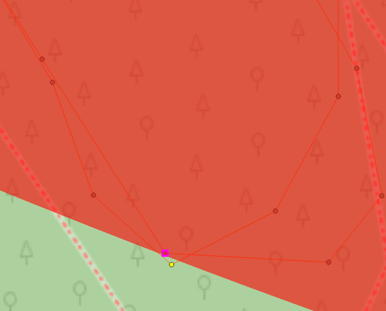

Работа выполнялась в QGIS с использованием инструмента «Temporal Controller Panel». Была взята проекция EPSG: 2528.

Сперва при помощи линейки была измерена длина круга. За точку отсчёта для первого круга была взята 95 точка трека со временем 14:09:03. За точку отсчёта для второго круга была взята 395 точка со временем 14:36:03. За точку окончания второго круга взята 689 точка трека со временем 15:02:35. Таким образом, время прохождения первого круга составило 27 минут, второго -- 26 минут 32 секунды (≈ 26,53 минуты).

Вычисление средней скорости прохождения круга:

(4496,66 + 4514,11) / (27+26,53) ≈ 168,33 м/мин ≈ 10,1 км/ч

Точка максимального удаления от базы была определена при помощи построения круглого полигона по точкам из центра (юго-западный угол спортивного клуба) к краю по радиусу поверх (наложением) трека (рис. 1). Таковой оказалась 565 точка трека. Расстояние от центра круга составило 719,7 м

+---------------------------------+------------------------------------+----------------------------------------+-------------------------------------------+-----------------------------------------+-------------------------------+
| Длина круга (первого и второго) | Средняя скорость прохождения круга | Время начала круга (первого и второго) | Время окончания круга (первого и второго) | Неравномерность перемещения             | Максимальное удаление от базы |
+:================================+:===================================+:=======================================+:==========================================+:========================================+:==============================+
| 4496,66 м                       | 10,1 км/ч                          | 14:09:03                               | 14:36:03                                  | Второй круг был пройден быстрее первого | 719,7 м                       |
|                                 |                                    |                                        |                                           |                                         |                               |
| 4514,11 м                       |                                    | 14:36:03                               | 15:02:35                                  |                                         |                               |
+---------------------------------+------------------------------------+----------------------------------------+-------------------------------------------+-----------------------------------------+-------------------------------+

: Таблица 1. Анализ трека

Движение по маршруту осуществлялось с примерно одной скоростью, что наглядно видно во время использования инструмента «Temporal Controller Panel». Но, видимо, происходило небольшое её снижение на поворотах. Второй круг был пройден немного быстрее первого.

<figure>

<figcaption>

Рисунок 1. Определение наиболее удалённой точки

</figcaption>
</figure>
